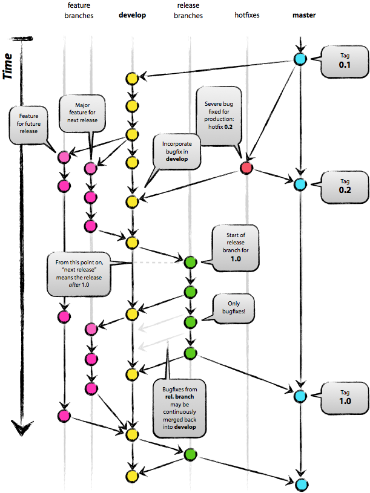

# tags-versioning

## Versioning:

Software versioning summary [source](https://en.wikipedia.org/wiki/Software_versioning):

|Stage |Versioning
--| --|
|Release |1.2.0	
|Post-release fixes |1.2.5

- Major - v1.0.0: Big release of features.
- Minor - v1.1.0 Small release features. 
- Patch - v1.1.1 Bug fixes, Patches, Typos, post release fixes.
- build/beta/rc - v1.1.1-beta, work in progress or beta build, E.g. 1.2.0-beta.

git tagging workflow:
[source](https://softwareengineering.stackexchange.com/questions/165725/git-branching-and-tagging-best-practices/165733#165733)




Git Create Tag
Create a **`lightweight`** tag on a current branch:

`$ git tag <tag_name>`

If you want to include a description with your tag, add -a to create an “annotated” tag,
Create an **`annotated`** tag with the given message (instead of prompting):

`$ git tag <tag_name> -a`

`$ git tag <tag_name> -a -m "Message"`

```
Annotated vs Lightweight: A Git tag created with -a option is called “annotated” tag. Whereas a tag without tagging message is called “lightweight” tag. “Annotated” tags are meant for releases while “lightweight” tags are meant for private or temporary object labels. For this reason, some git commands for naming objects (like git describe) will ignore “lightweight” tags by default.
```

`$ git describe`

```
v1.0.0
   |--------------- the current commit is tagged with this tag name
```

Push all tags to remote

`$ git push origin --tags`


Push a single tag to remote

`$ git push origin <tag_name>`

## Delete a remote Git tag:

`$ git push origin :refs/tags/<tag_name>`

Alternatively, a remote Git tag can be deleted as follows:

`$ git push -d origin <tag_name>`

## Remove Local Git Tag
Remove a Git tag from a local repository:

`$ git tag -d <tag_name>`
